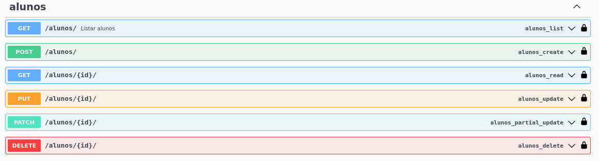
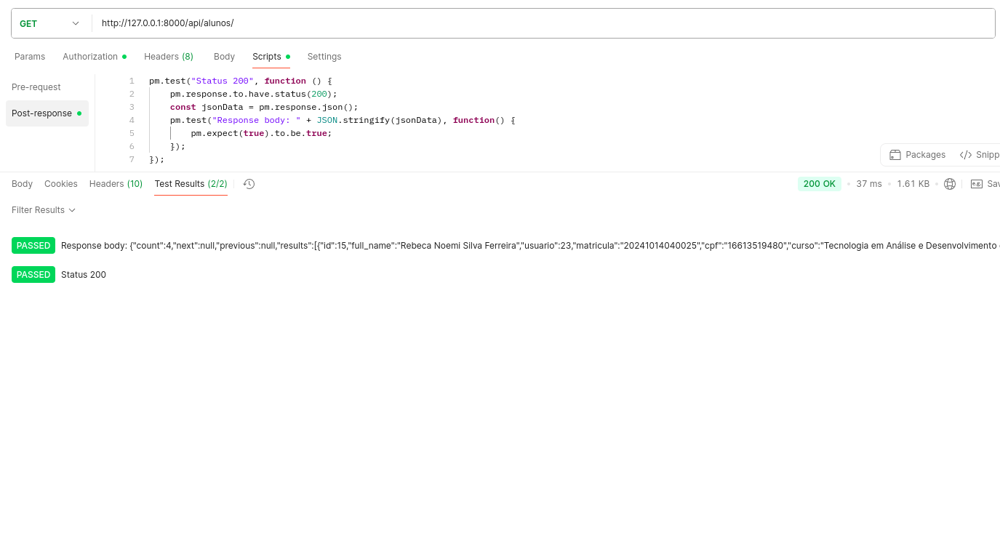
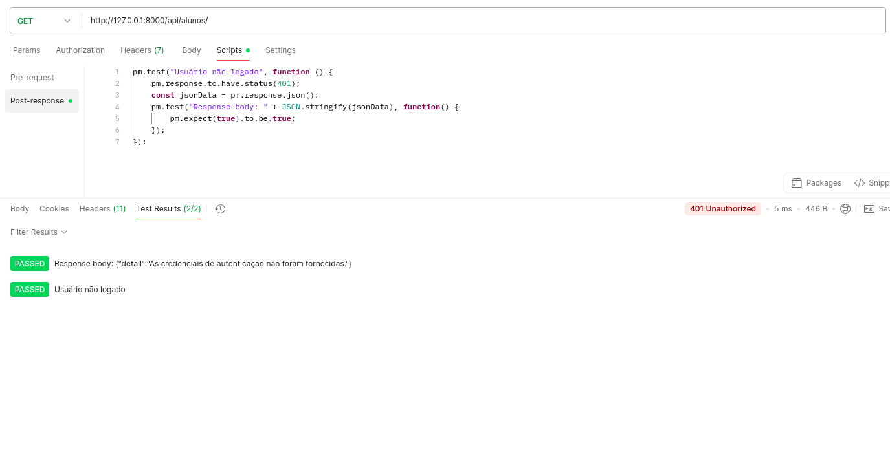
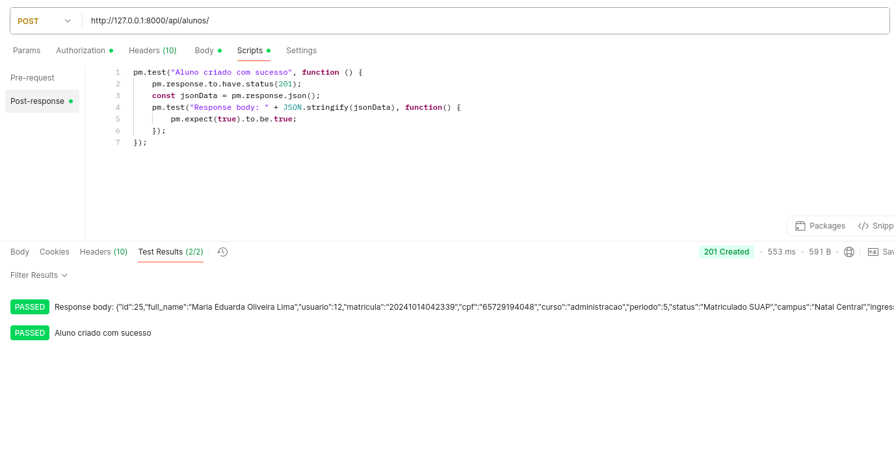
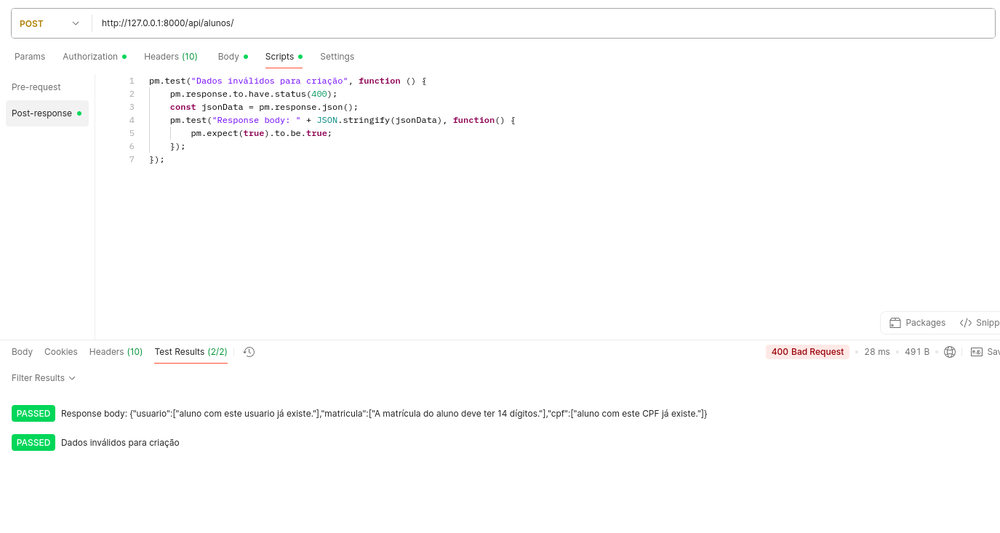
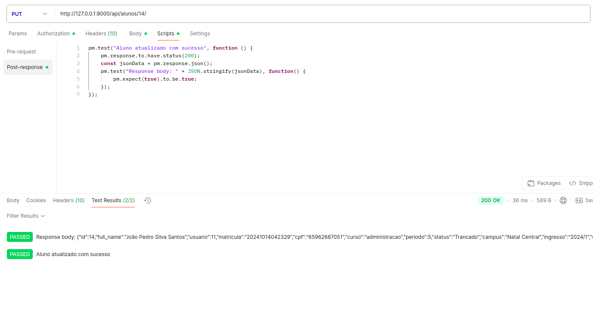
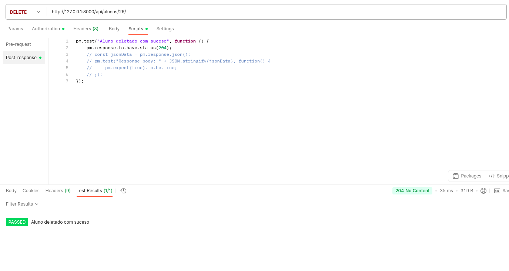
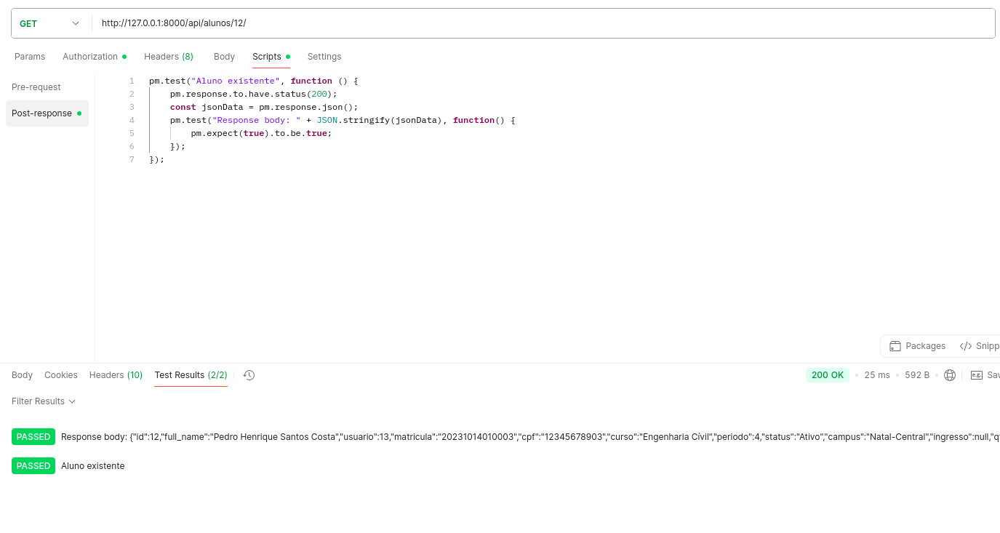
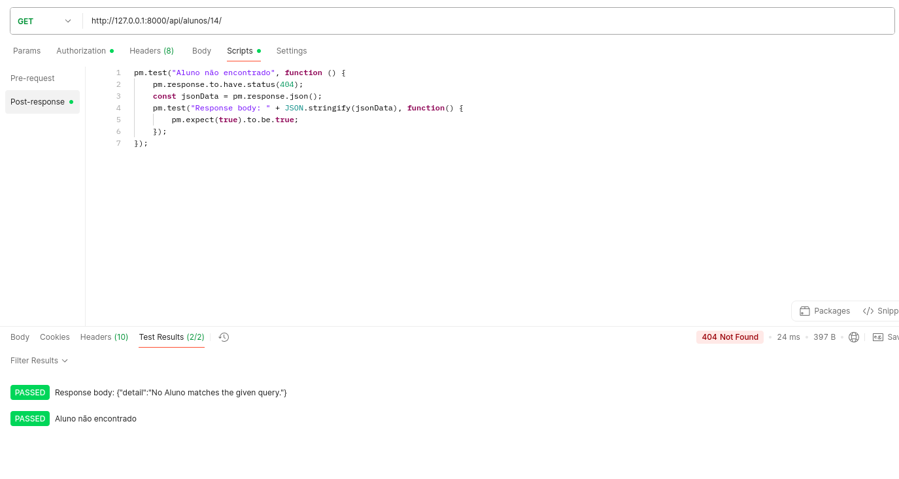

## Endpoints Aluno 
Para realizar os testes nos endpoints é preciso fazer o login pela API nas rotas de GET /auth/login/ para pegar a url de login no suap e depois o code gerado. Depois é necessário rodar o POST /auth/exchange/ passando o code e pegar na response o access token. Com o access token, inserimos ele no Authorization do Postman como Bearer Token.

### AL-01 – Listar alunos autenticado

### AL-02 – Listar alunos sem autenticação

### AL-03 – Criar aluno com dados válidos 

### AL-04 – Criar aluno com dados inválidos

### AL-05 – Atualizar aluno existente

### AL-06 – Atualizar aluno inexistente

### AL-07 – Deletar aluno existente

### AL-08 – Deletar aluno inexistente

### AL-09 – Lista aluno pelo id existente

### AL-10 – Lista aluno pelo id inexistente

