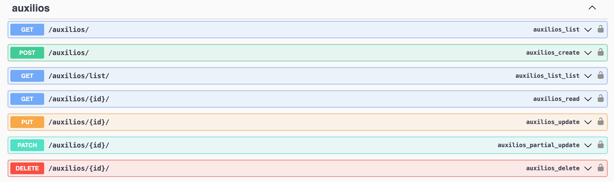
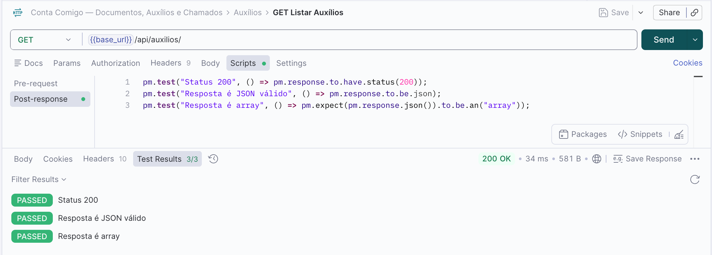
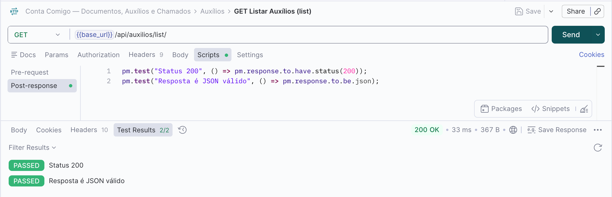
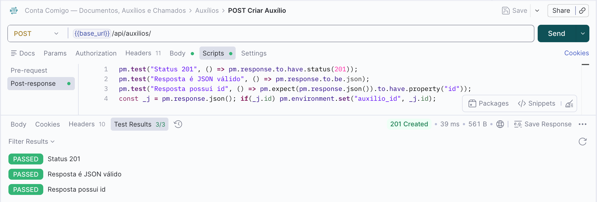
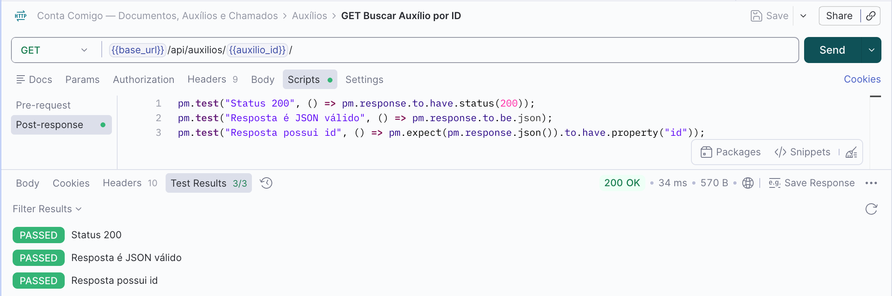
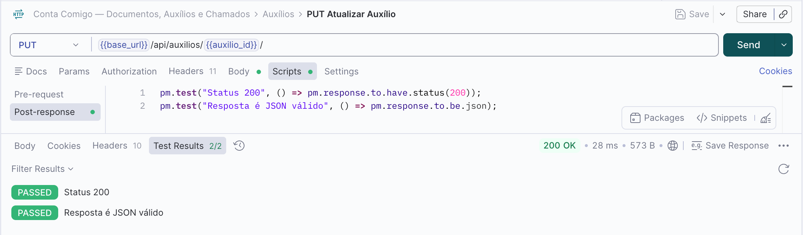
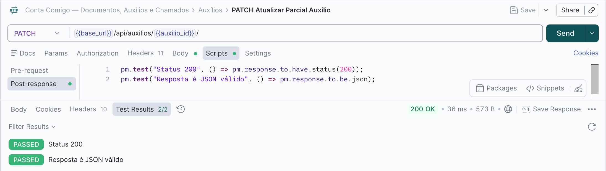
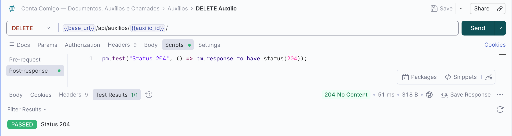
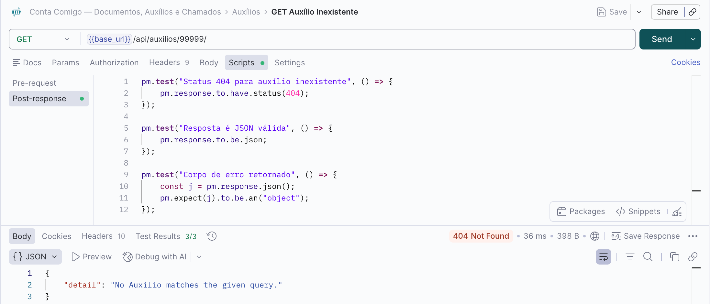

## Endpoints Auxílios 
Para realizar os testes nos endpoints é preciso fazer o login pela API nas rotas de GET /auth/login/ para pegar a url de login no suap e depois o code gerado. Depois é necessário rodar o POST /auth/exchange/ passando o code e pegar na response o access token. Com o access token, inserimos ele no Authorization do Postman como Bearer Token.

### GET Listar Auxílios

### GET Listar Auxílios (list)

### POST Criar Auxílios

### GET Buscar Auxílio por ID

### PUT Atualizar Auxílio

### PATCH Atualizar Parcial Auxílio

### DELETE Auxílio

### GET Auxílio Inexistente
