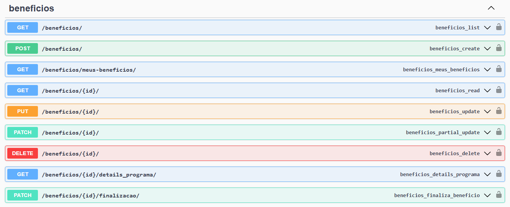
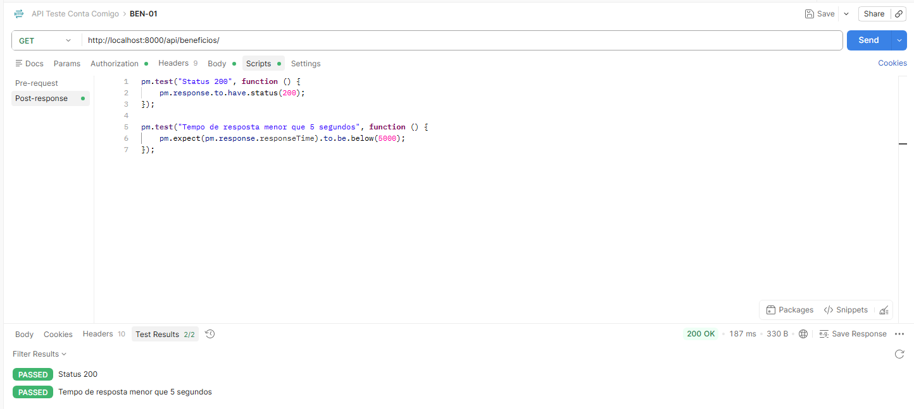
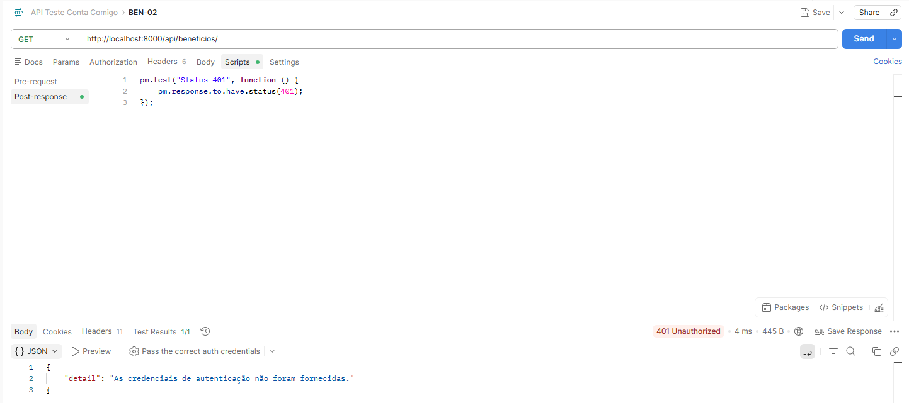
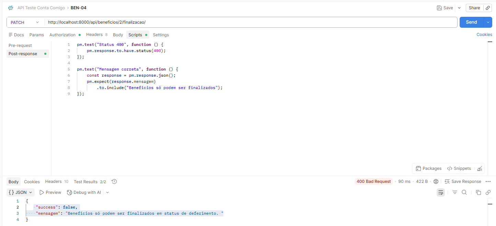

## Endpoints Benefício 
Não existiam registros de benefícios disponíveis no ambiente de testes, impossibilitando a execução dos cenários que dependem de benefícios previamente cadastrados. Foram executados os cenários aplicáveis ao estado atual da base de dados, incluindo autenticação, consultas sem registros e tratamento de erros.

### BEN-01 – Listar benefícios autenticado

### BEN-02 – Listar benefícios sem autenticação

### BEN-03 – Consultar benefício inexistente

### BEN-04 – Finalizar benefício inexistente
