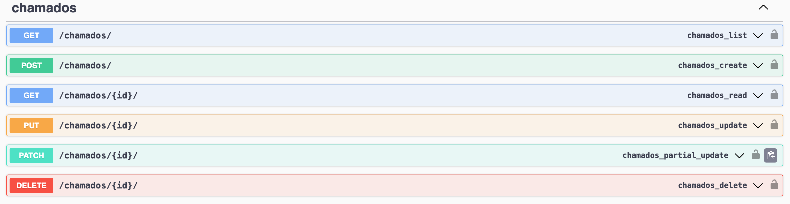
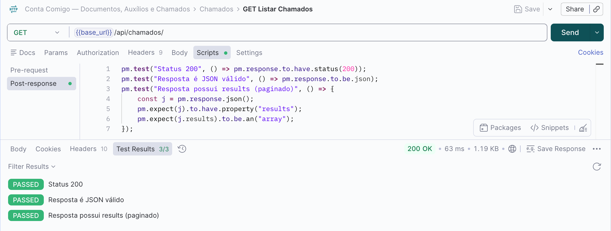
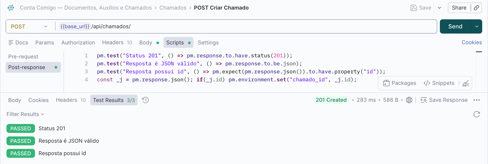
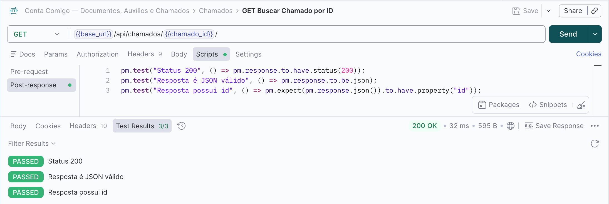
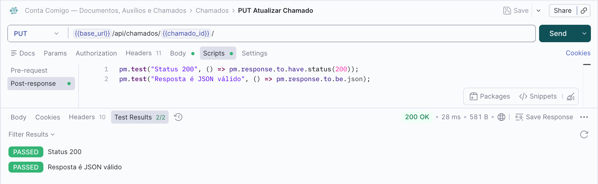
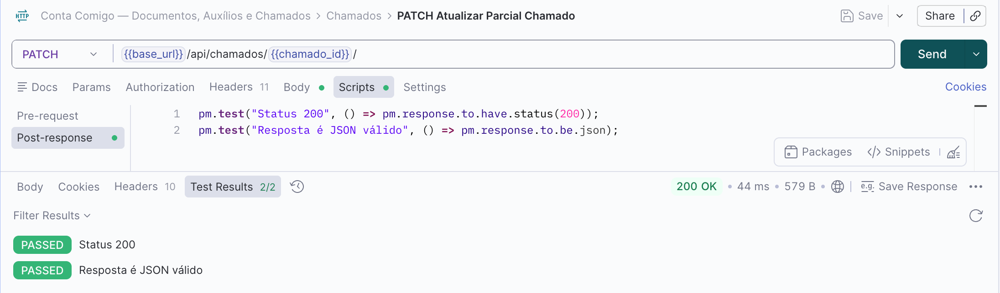
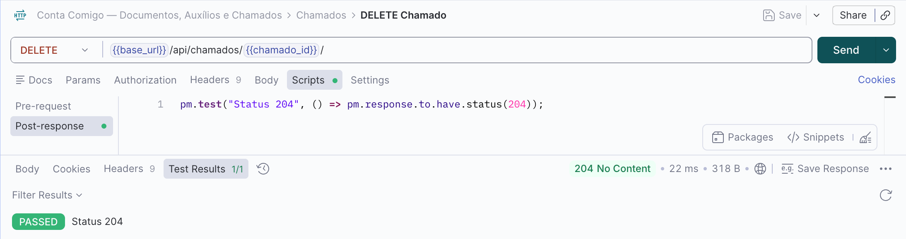
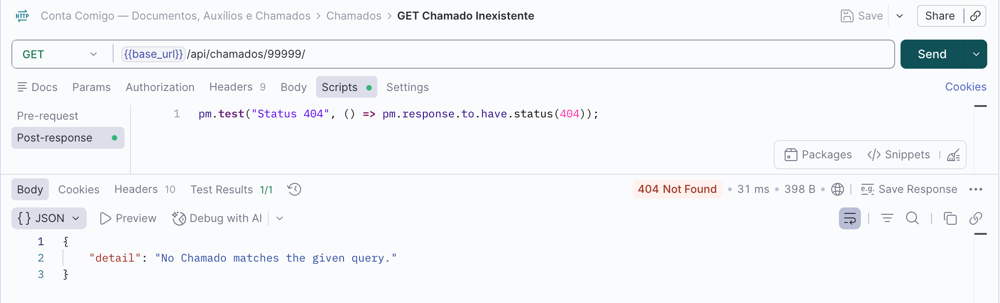
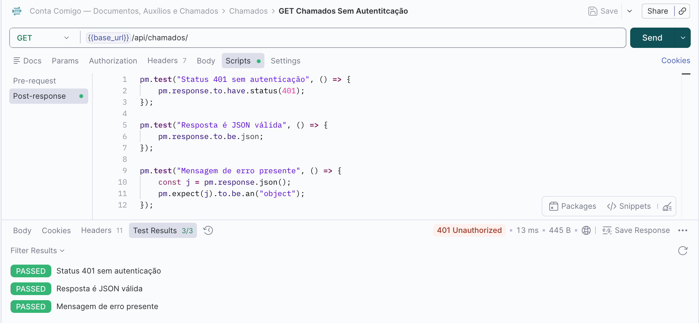

## Endpoints Chamados
Para realizar os testes nos endpoints é preciso fazer o login pela API nas rotas de GET /auth/login/ para pegar a url de login no suap e depois o code gerado. Depois é necessário rodar o POST /auth/exchange/ passando o code e pegar na response o access token. Com o access token, inserimos ele no Authorization do Postman como Bearer Token.

### GET Listar Chamados

## POST Criar Chamados

### GET Buscar Chamado por ID

### PUT Atualizar Chamado

### PATCH Atualizar Parcial Chamado

### DELETE Chamado

### GET Chamado Inexistente

### GET Chamados Sem Autenticação
