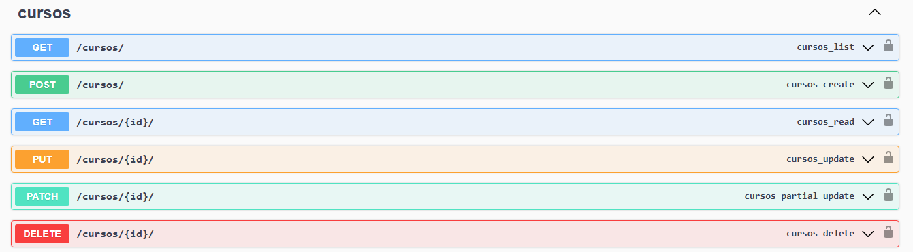
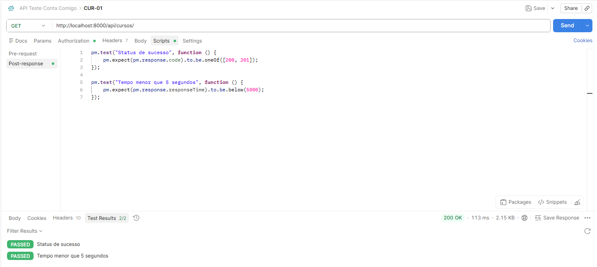
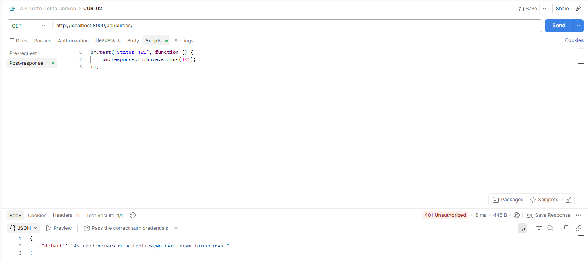
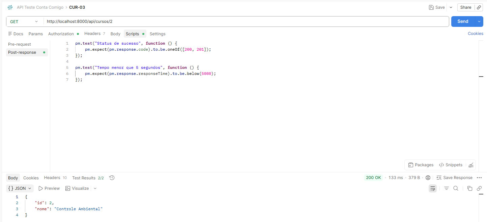
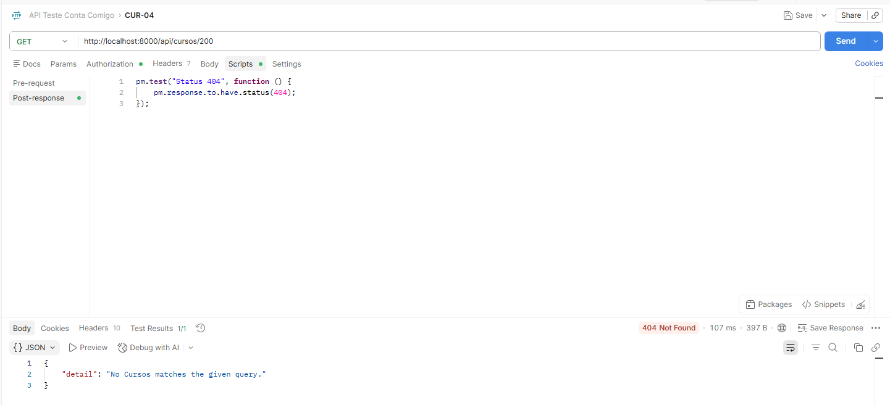
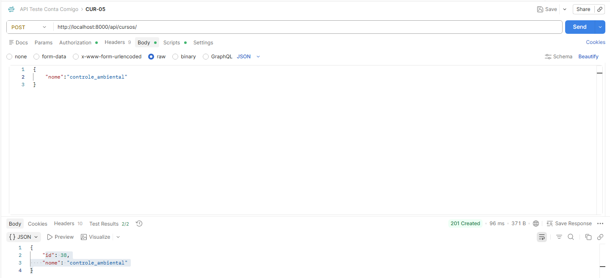
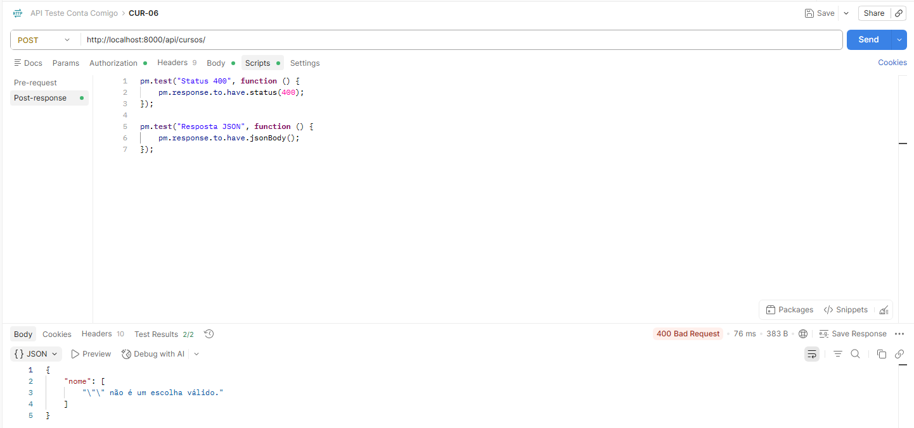
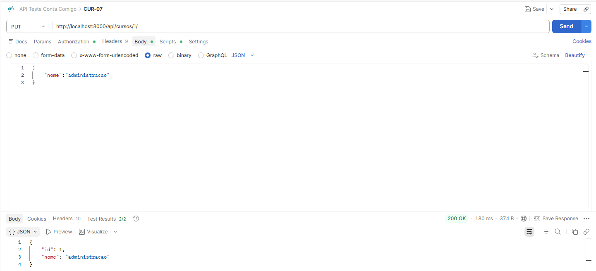

## Endpoints Cursos
Para realizar os testes nos endpoints é preciso fazer o login pela API nas rotas de GET /auth/login/ para pegar a url de login no suap e depois o code gerado. Depois é necessário rodar o POST /auth/exchange/ passando o code e pegar na response o access token. Com o access token, inserimos ele no Authorization do Postman como Bearer Token.



### CUR-01 – Listar cursos autenticado


### CUR-02 – Listar cursos sem autenticação


### CUR-03 – Consultar curso existente


### CUR-04 – Consultar curso inexistente


### CUR-05 – Criar curso válido
#### Para criar o curso ele precisa estar inserido no dicionário


### CUR-06 – Criar curso sem nome
#### Body da requisição 
```json
{
    "nome":""
}
```


### CUR-07 – Atualizar curso existente
#### Para atualizar o curso ele precisa estar inserido no dicionário

