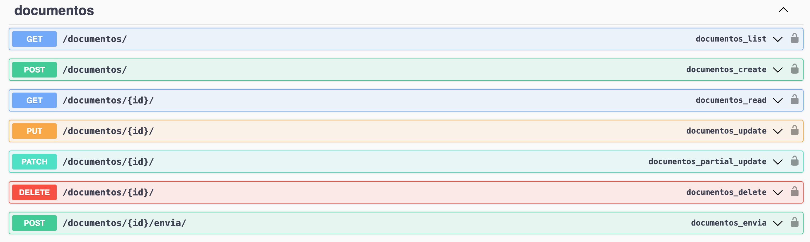
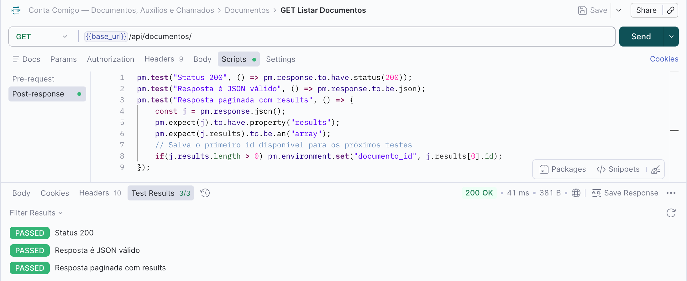
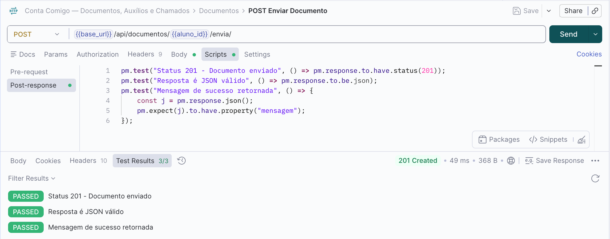
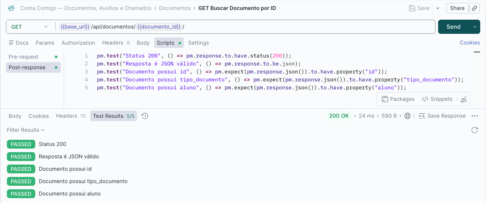
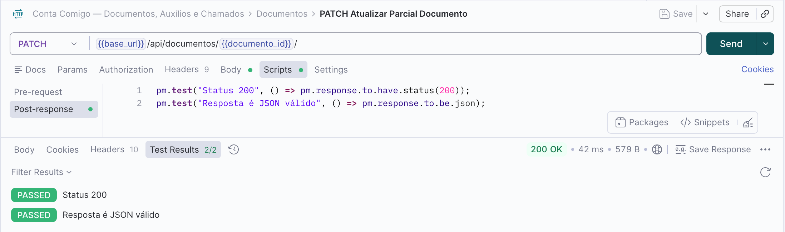
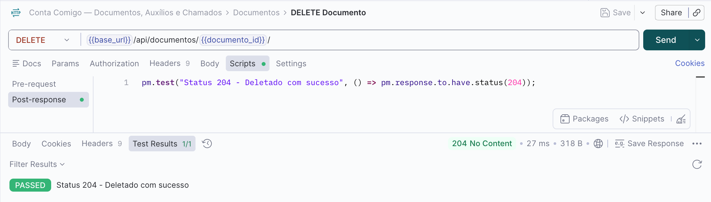
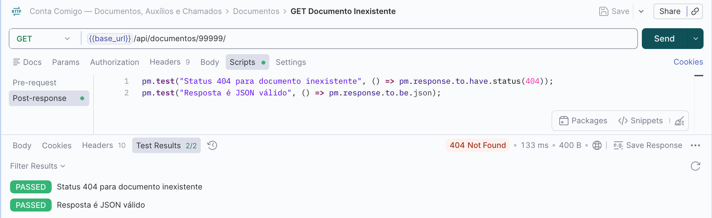
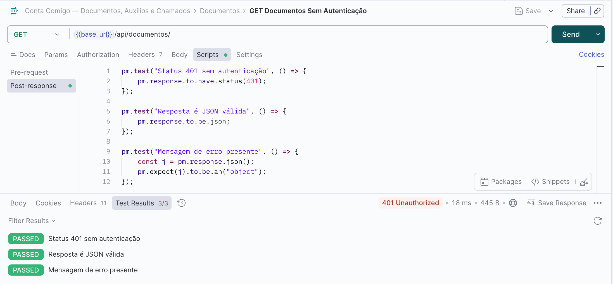

## Endpoints Documentos
Para realizar os testes nos endpoints é preciso fazer o login pela API nas rotas de GET /auth/login/ para pegar a url de login no suap e depois o code gerado. Depois é necessário rodar o POST /auth/exchange/ passando o code e pegar na response o access token. Com o access token, inserimos ele no Authorization do Postman como Bearer Token.

### GET Listar Documentos

## POST Enviar Documento

Obs.: para funcionar adequadamento, precisa ser inserido manualmente um arquito de teste, pode ser um PDF ou uma imagem, caso contrário o teste retornará erro 400. 

### GET Buscar Documento por ID

### PATCH Atualizar Parcial Documento

### DELETE Documento

### GET Documento Inexistente

### GET Documentos Sem Autenticação

Obs.: Diferente dos testes de auxílios e chamados, os testes de documentos não precisam ser rodados um por um, pois se forem rodados em sequencia, através do runner colltection do postman, na versão gratúita, o arquvio não consegue ser anexado, e sem ele não é possível fazer o upload e nem prosseguir com os demais testes, visto que não será criado id de documento. 