## Endpoints Perguntas 
Para realizar os testes nos endpoints é preciso fazer o login pela API nas rotas de GET /auth/login/ para pegar a url de login no suap e depois o code gerado. Depois é necessário rodar o POST /auth/exchange/ passando o code e pegar na response o access token. Com o access token, inserimos ele no Authorization do Postman como Bearer Token.
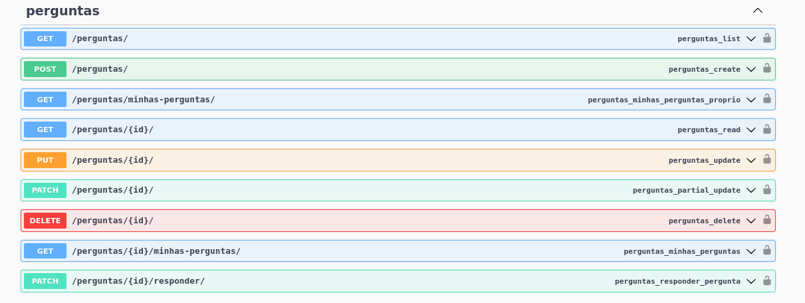

### PE-01 – Assistente social tenta criar pergunta
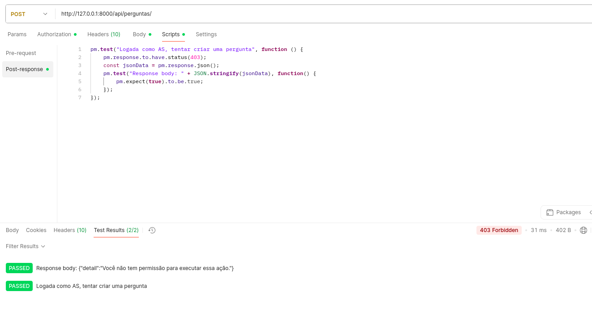
### PE-02 – Assistente social logada ver todas perguntas
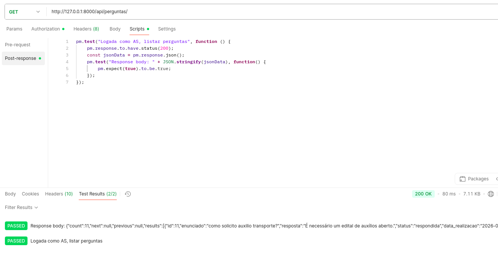
### PE-03 – Assistente social (não é aluno) tenta acessar suas próprias perguntas

### PE-04 – Assinste social tenta responder pergunta existente com status de 'nao_respondida'
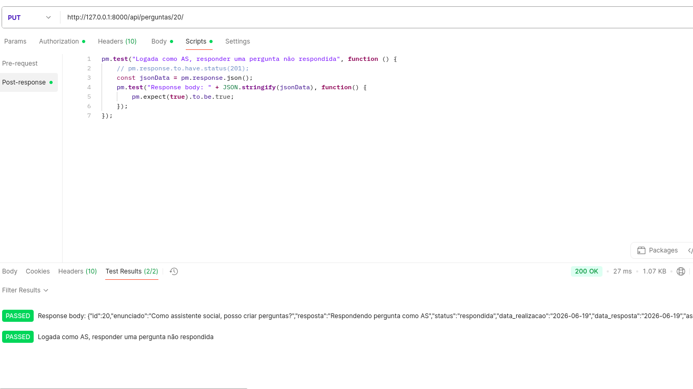
### PE-05 – Assinste social tenta responder pergunta existente com status de 'respondida'
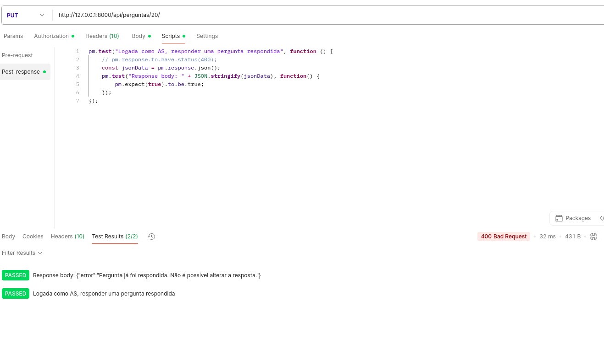
### PE-06 – Assinste social tenta responder pergunta inexistente

### PE-07 – Assistente social autenticada responder pergunta com dados inválidos
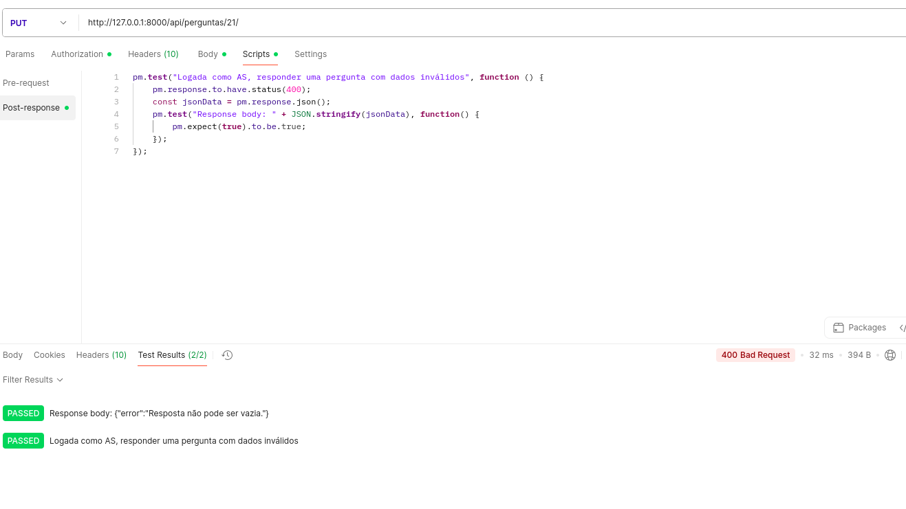

### PE-08 – Aluno autenticado cria pergunta com dados válidos
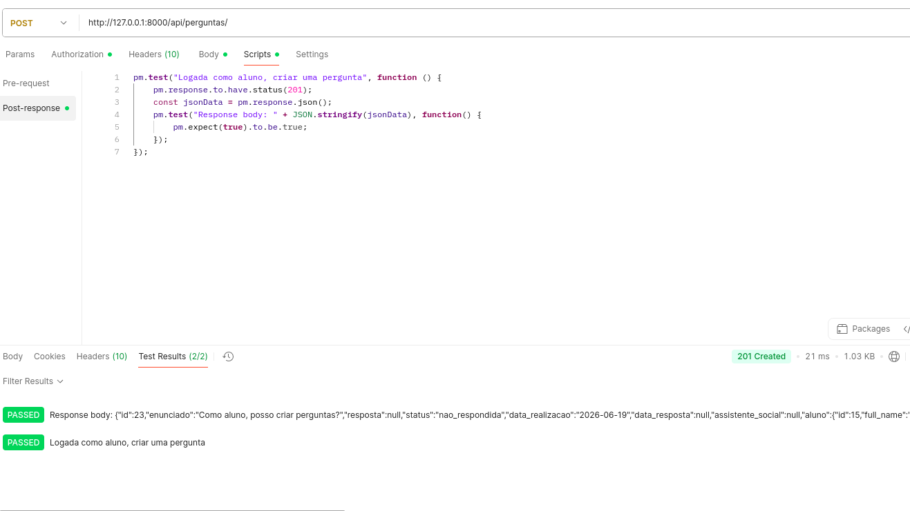
### PE-09 – Aluno autenticado ver minhas perguntas
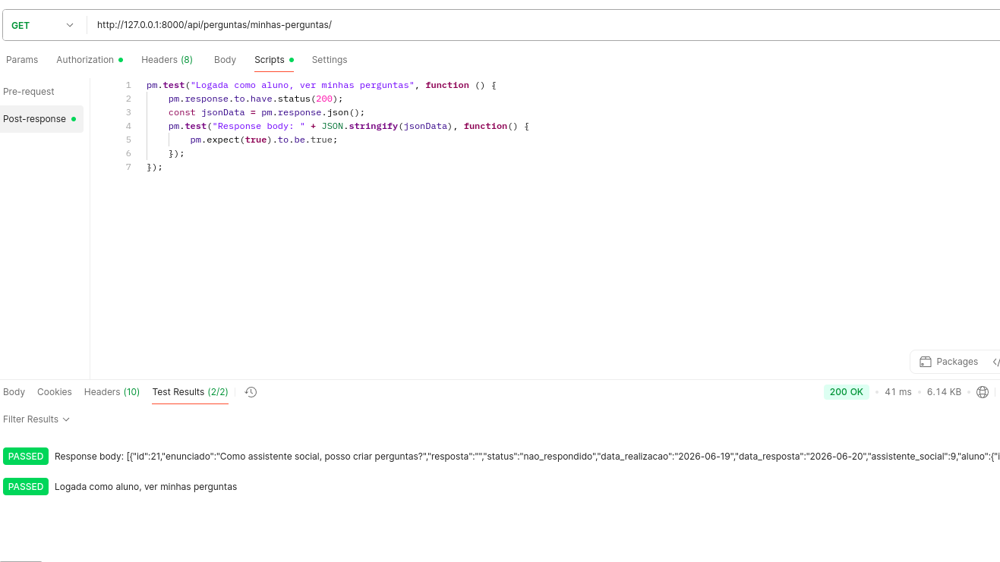
### PE-10 – Aluno autenticado cria pergunta com dados inválidos (campos obrigatórios faltando)

### PE-12 – Aluno tenta responder pergunta
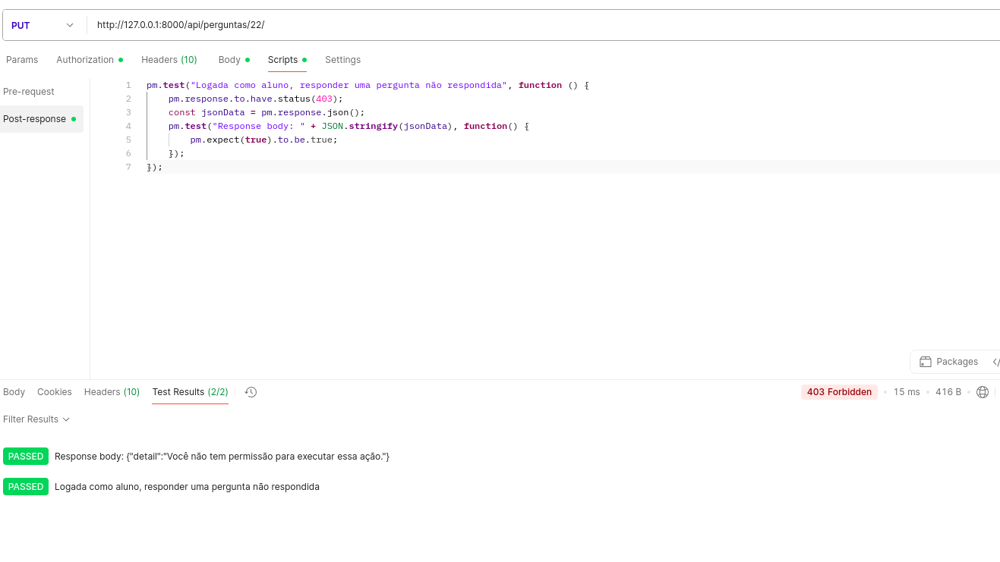
### PE-12 – Aluno autenticado com filtro ?respondida=true retorna apenas perguntas respondidas
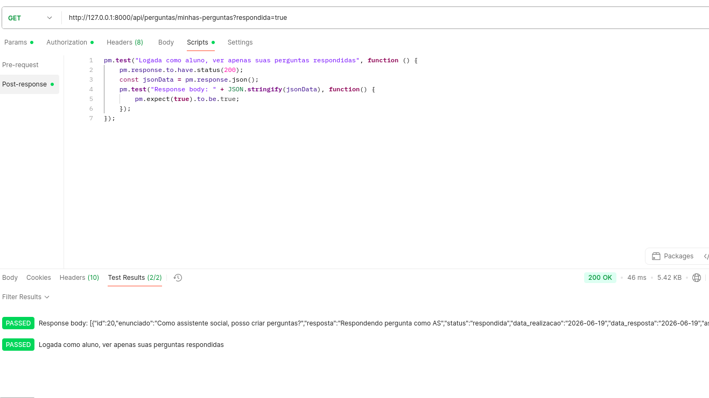
### PE-13 – Aluno autenticado com filtro ?respondida=false retorna apenas perguntas não respondidas

### PE-14 – Aluno sem perguntas cadastradas gera 404

### PE-15 – Usuário não autenticado tenta responder pergunta

### PE-16 – Usuário não autenticado tenta criar pergunta
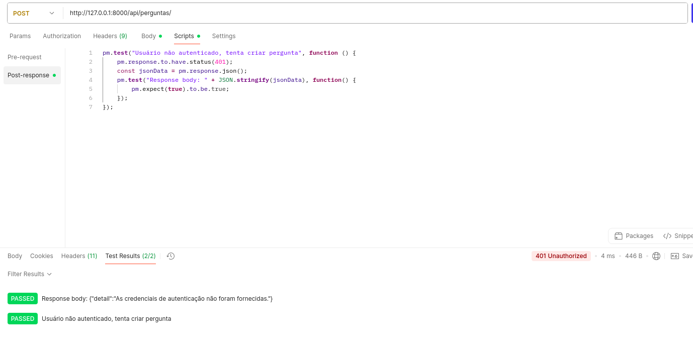
### PE-17 – Usuário não autenticado tenta acessar suas próprias perguntas
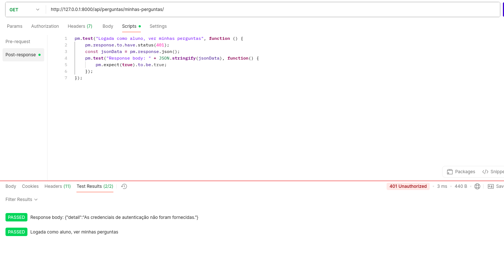

