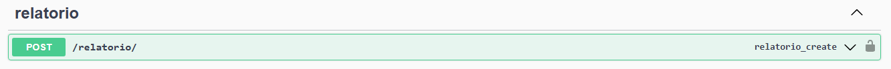
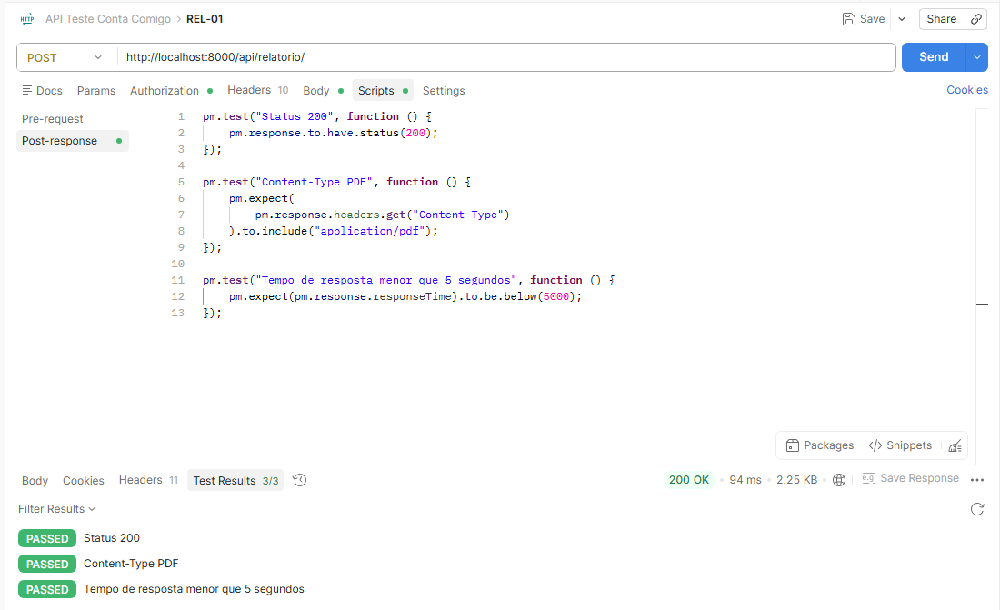
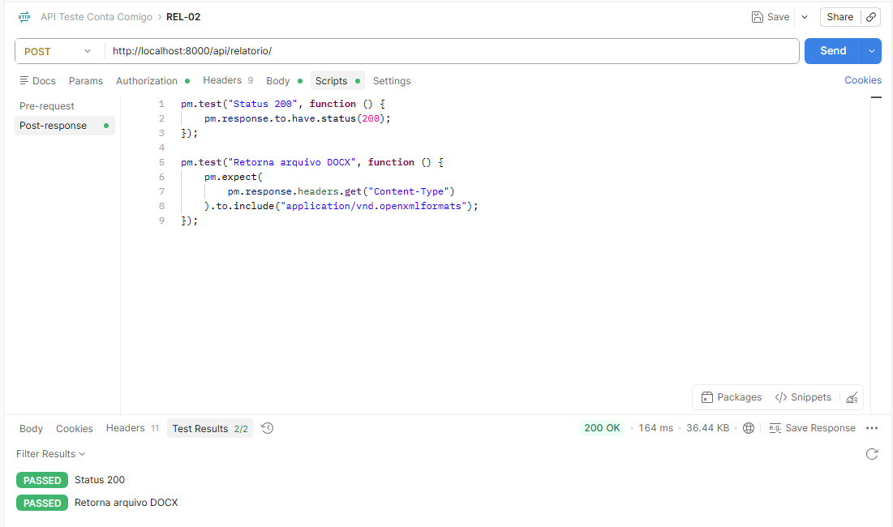
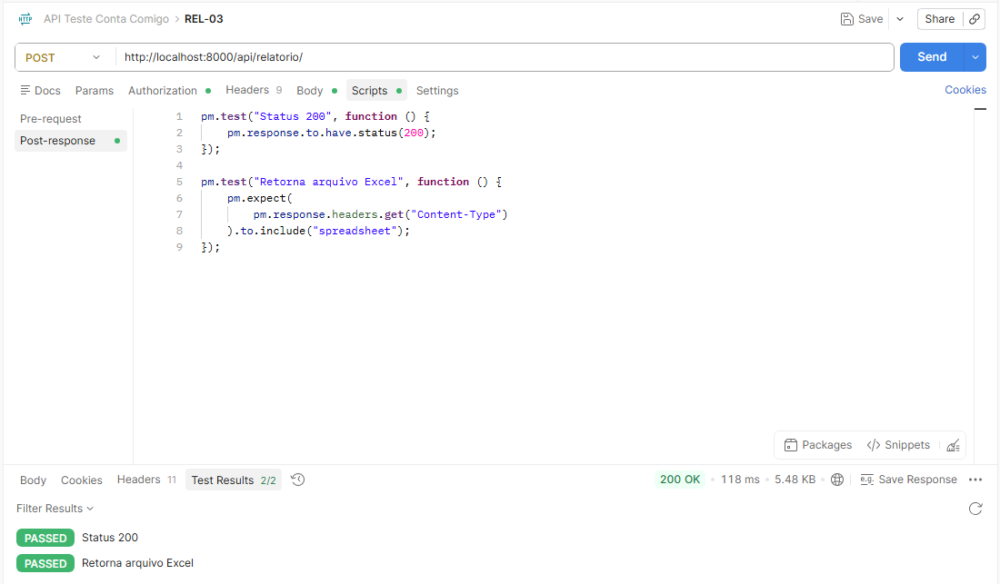
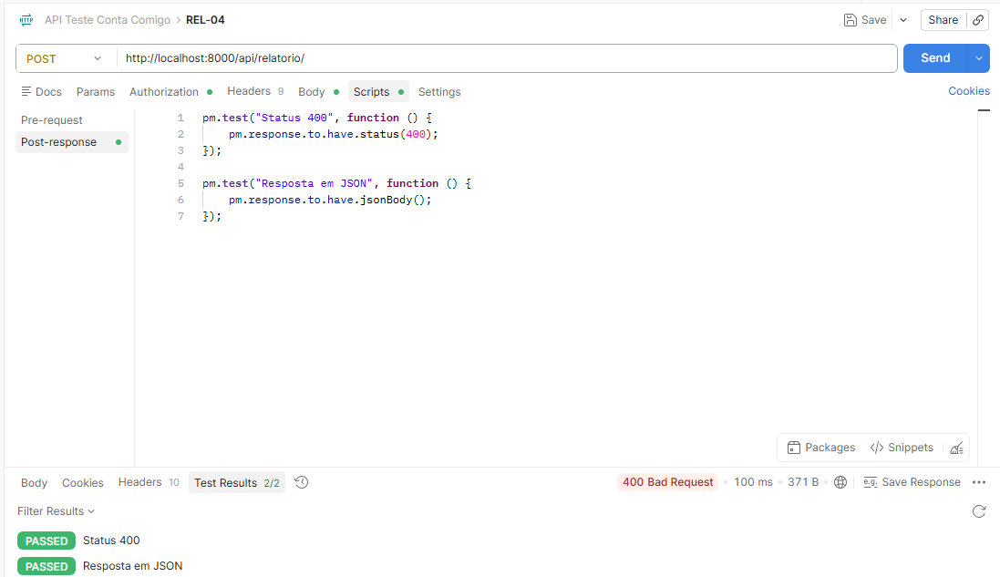
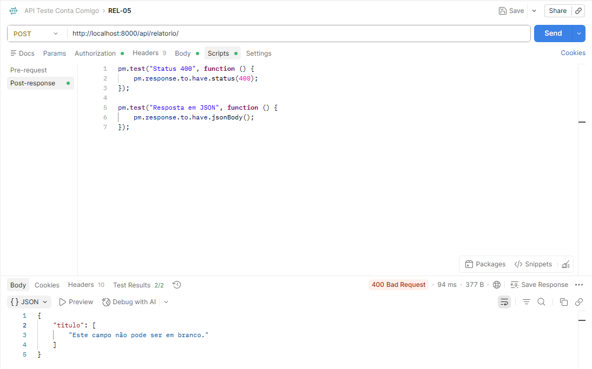
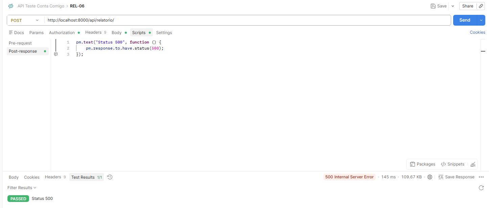
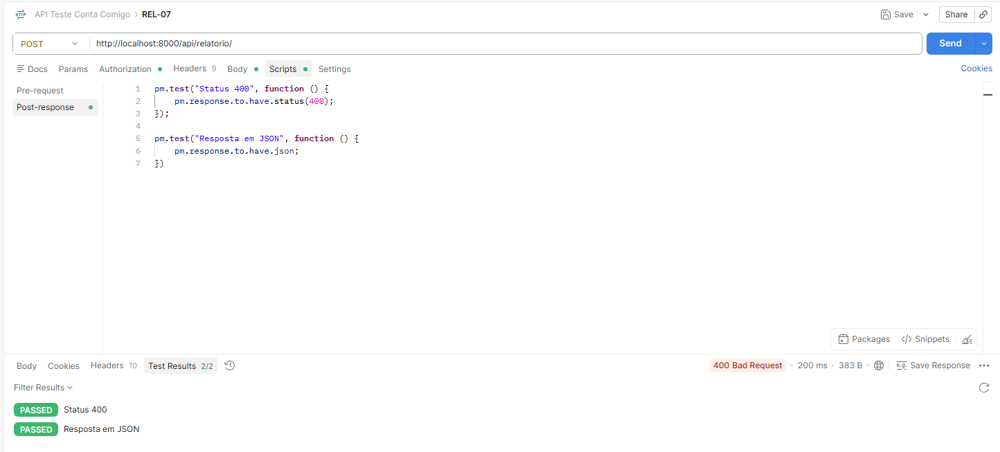

## Endpoint Relatórios

 Para realizar os testes nos endpoints é preciso fazer o login pela API nas rotas de GET /auth/login/ para pegar a url de login no suap e depois o code gerado. Depois é necessário rodar o POST /auth/exchange/ passando o code e pegar na response o access token. Com o access token, inserimos ele no Authorization do Postman como Bearer Token. É preciso que esteja logado como Assistente Social.

### REL-01 – Gerar relatório PDF válido 
#### Body da requisição 
```json
{
  "ano": "2025",
  "titulo": "relatorio teste 1",
  "programa": "2",
  "situacao_sistemica": "string",
  "ingresso": "string",
  "curso": "1",
  "periodo_referencia": "2",
  "situacao_periodo": "string",
  "turno": "string",
  "formato_relatorio": "pdf"
}
```


### REL-02 – Gerar relatório DOCX válido
#### Body da requisição
```json
{
  "ano": "2025",
  "titulo": "relatorio teste 1",
  "programa": "2",
  "situacao_sistemica": "string",
  "ingresso": "string",
  "curso": "1",
  "periodo_referencia": "2",
  "situacao_periodo": "string",
  "turno": "string",
  "formato_relatorio": "docx"
}
```


### REL-03 – Gerar relatório Excel válido
#### Body da requisição
```json
{
  "ano": "2025",
  "titulo": "relatorio teste 1",
  "programa": "2",
  "situacao_sistemica": "string",
  "ingresso": "string",
  "curso": "1",
  "periodo_referencia": "2",
  "situacao_periodo": "string",
  "turno": "string",
  "formato_relatorio": "excel"
}
```


### REL-04 – Gerar relatório com formato inválido (CSV)
#### Body da requisição
```json
{
  "ano": "2025",
  "titulo": "relatorio teste 1",
  "programa": "2",
  "situacao_sistemica": "string",
  "ingresso": "string",
  "curso": "1",
  "periodo_referencia": "2",
  "situacao_periodo": "string",
  "turno": "string",
  "formato_relatorio": "csv"
}
```


### REL-05 – Gerar relatório com título vazio
#### Body da requisição
```json
{
  "ano": "2025",
  "titulo": "",
  "programa": "2",
  "situacao_sistemica": "string",
  "ingresso": "string",
  "curso": "1",
  "periodo_referencia": "2",
  "situacao_periodo": "string",
  "turno": "string",
  "formato_relatorio": "pdf"
}
```


### REL-06 – Gerar relatório com curso inexistente
#### Body da requisição 
```json
{
  "ano": "2025",
  "titulo": "relatorio teste 2",
  "programa": "2",
  "situacao_sistemica": "string",
  "ingresso": "string",
  "curso": "200",
  "periodo_referencia": "2",
  "situacao_periodo": "string",
  "turno": "string",
  "formato_relatorio": "pdf"
}
```


### REL-07 – Gerar relatório com curso não numérico
#### Body da requisição 
```json
{
  "ano": "2025",
  "titulo": "relatorio teste 2",
  "programa": "2",
  "situacao_sistemica": "string",
  "ingresso": "string",
  "curso": "ADS",
  "periodo_referencia": "2",
  "situacao_periodo": "string",
  "turno": "string",
  "formato_relatorio": "pdf"
}
```

