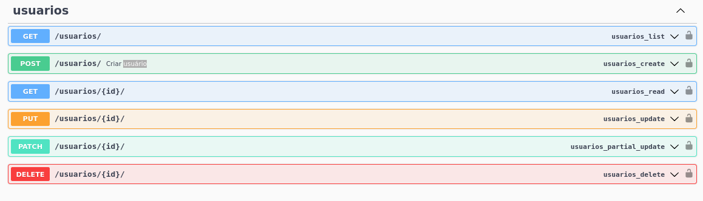
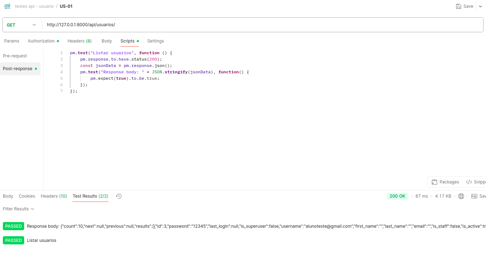
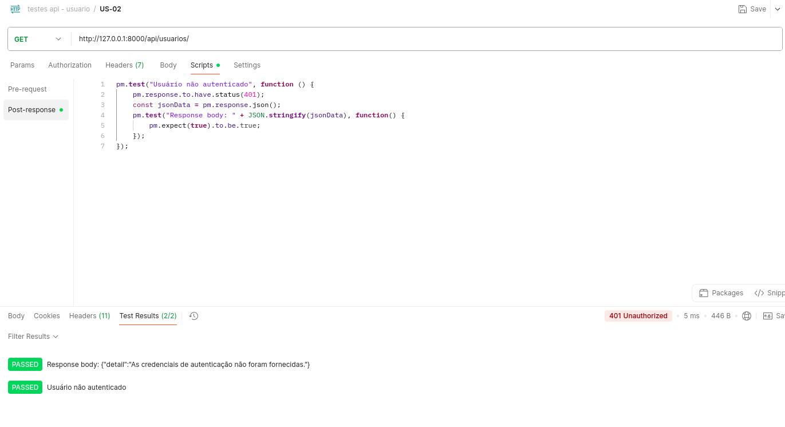
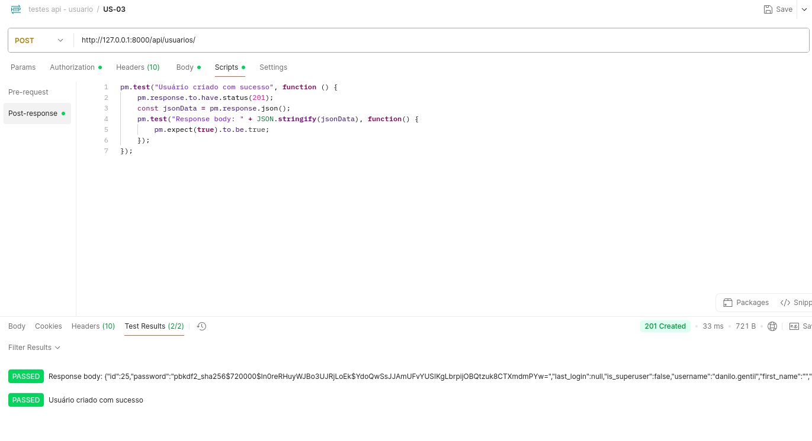
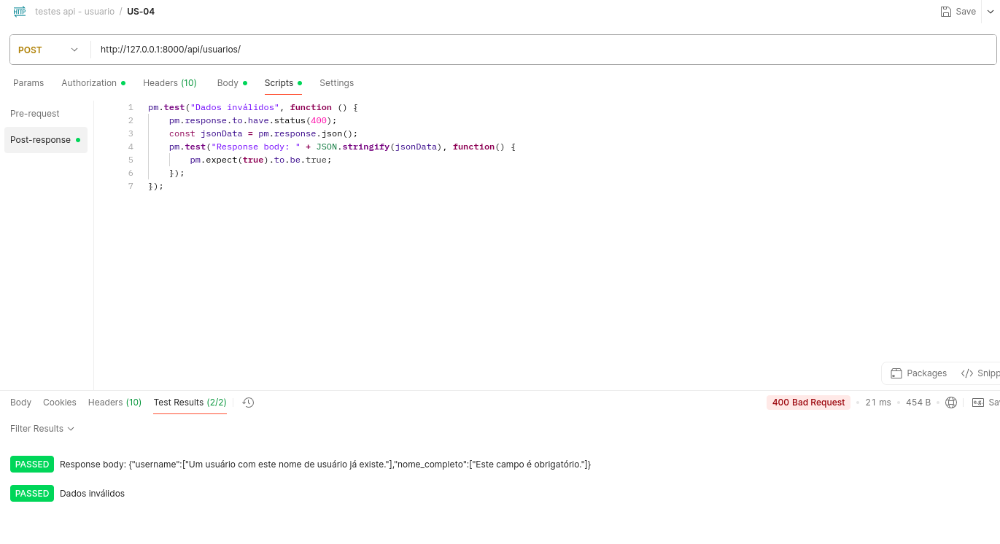
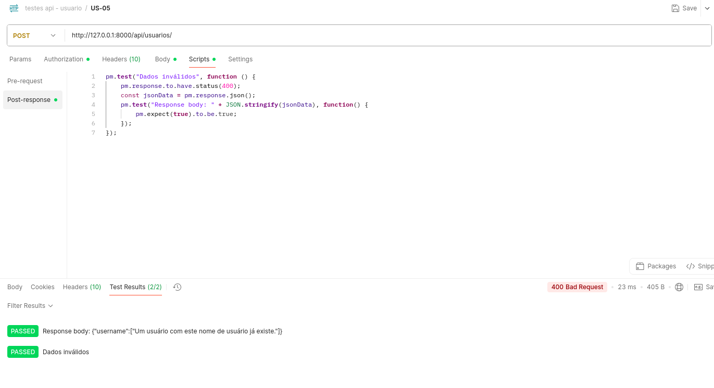
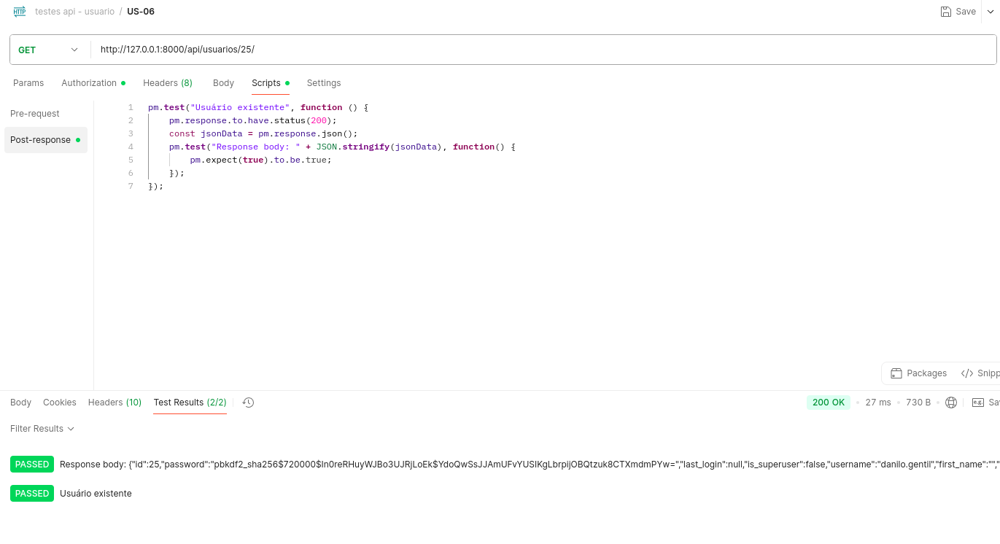

## Endpoints Usuario 
Para realizar os testes nos endpoints é preciso fazer o login pela API nas rotas de GET /auth/login/ para pegar a url de login no suap e depois o code gerado. Depois é necessário rodar o POST /auth/exchange/ passando o code e pegar na response o access token. Com o access token, inserimos ele no Authorization do Postman como Bearer Token.

### US-01 – Listar usuários com sucesso

### US-02 – Listar usuários sem autenticação

### US-03 – Criar usuário com dados válidos

### US-04 – Criar usuário com dados inválidos (campos obrigatórios faltando)

### US-05 – Criar usuário com email/username duplicado

### US-06 – Lista usuário pelo id existente

### US-07 – Lista usuário pelo id inexistente
